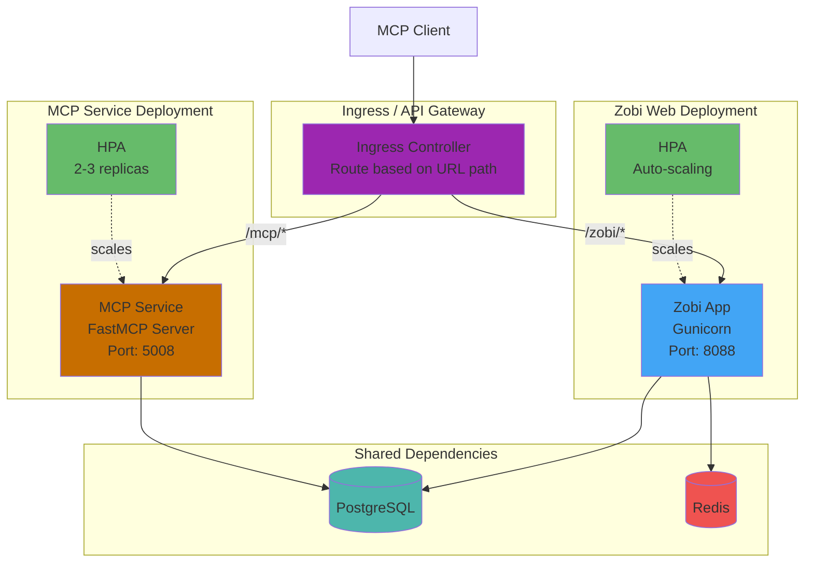
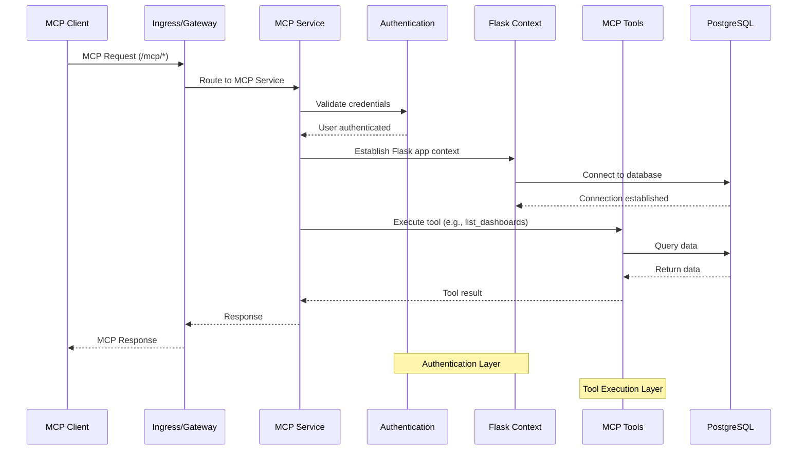

# Zobi MCP Service

> **What is this?** The MCP service allows an AI Agent to directly interact with Zobi, enabling natural language queries and commands for data visualization.

> **How does it work?** This service is part of the Zobi codebase. You need to:
> 1. Have Zobi installed and running
> 2. Connect an agent such as Claude Desktop to your Zobi instance using this MCP service
> 3. Then Claude can create charts, query data, and manage dashboards

The Zobi Model Context Protocol (MCP) service provides a modular, schema-driven interface for programmatic access to Zobi dashboards, charts, datasets, and instance metadata. It is designed for LLM agents and automation tools, and is built on the FastMCP protocol.

## 🚀 Quickstart

### Option 1: Docker Setup (Recommended) 🎯

The fastest way to get everything running with Docker:

**Prerequisites:** Docker and Docker Compose installed

```bash
# 1. Clone the repository
git clone https://github.com/HafizMMoaz/zobi.git
cd zobi

# 2. Start Zobi and MCP service with docker-compose-light
docker-compose -f docker-compose-light.yml --profile mcp build
docker-compose -f docker-compose-light.yml --profile mcp up -d

# 3. Initialize Zobi (first time only)
docker exec -it zobi-zobi-light-1 zobi fab create-admin \
  --username admin \
  --firstname Admin \
  --lastname Admin \
  --email admin@localhost \
  --password admin

docker exec -it zobi-zobi-light-1 zobi db upgrade
docker exec -it zobi-zobi-light-1 zobi init
```

**That's it!** ✨
- Zobi frontend is running at http://localhost:9001 (login: admin/admin)
- MCP service is running on port 5008
- Now configure Claude Desktop (see Step 2 below)

#### What Docker Compose does:
- Sets up PostgreSQL database
- Builds and runs Zobi containers
- Starts the MCP service (with `--profile mcp`)
- Handles all networking and dependencies
- Provides hot-reload for development

#### Customizing ports:
```bash
# Use different ports if defaults are in use
NODE_PORT=9002 MCP_PORT=5009 docker-compose -f docker-compose-light.yml --profile mcp up -d
```

### Option 2: Manual Setup

If Docker is not available, you can set up manually:

```bash
# 1. Clone the repository
git clone https://github.com/HafizMMoaz/zobi.git
cd zobi

# 2. Set up Python environment (Python 3.10 or 3.11 required)
python3 -m venv venv
source venv/bin/activate

# 3. Install dependencies
pip install -e .[development,fastmcp]
cd frontend && npm ci && npm run build && cd ..

# 4. Configure Zobi manually
# Create zobi_config.py in your current directory:
cat > zobi_config.py << 'EOF'
# Zobi Configuration
SECRET_KEY = '<your secret here - hint: `secrets.token_urlsafe(42)`>'

# Session configuration for local development
SESSION_COOKIE_HTTPONLY = True
SESSION_COOKIE_SECURE = False
SESSION_COOKIE_SAMESITE = 'Lax'
SESSION_COOKIE_NAME = 'zobi_session'
PERMANENT_SESSION_LIFETIME = 86400

# CSRF Protection (disable if login loop occurs)
WTF_CSRF_ENABLED = True
WTF_CSRF_TIME_LIMIT = None

# MCP Service Configuration
# REQUIRED: Set this to your actual Zobi username
# The service will fail if not configured
MCP_DEV_USERNAME = 'admin'
ZOBI_WEBSERVER_ADDRESS = 'http://localhost:9001'

# WebDriver Configuration for screenshots
WEBDRIVER_BASEURL = 'http://localhost:9001/'
WEBDRIVER_BASEURL_USER_FRIENDLY = WEBDRIVER_BASEURL

EOF

# 5. Initialize database
export FLASK_APP=zobi
zobi db upgrade
zobi init

# 6. Create admin user
zobi fab create-admin \
  --username admin \
  --firstname Admin \
  --lastname Admin \
  --email admin@localhost \
  --password admin

# 7. Start Zobi (in one terminal)
zobi run -p 9001 --with-threads --reload --debugger

# 8. Start frontend (in another terminal)
cd frontend && npm run dev

# 9. Start MCP service (in another terminal, only if you want MCP features)
source venv/bin/activate
zobi mcp run --port 5008 --debug
```

Access Zobi at http://localhost:9001 (login: admin/admin)

## 🔌 Step 2: Connect Claude Desktop

### For Docker Setup

Since the MCP service runs inside Docker on port 5008, you need to connect Claude Desktop to the HTTP endpoint:

Add this to your Claude Desktop config file:

**macOS**: `~/Library/Application Support/Claude/claude_desktop_config.json`

Since claude desktop doesnt like non https mcp servers you can use this proxy:
```json
{
  "mcpServers": {
    "Zobi MCP Proxy": {
      "command": "/<zobi folder>/zobi/mcp_service/run_proxy.sh",
      "args": [],
      "env": {}
    }
  }
}
```

### For Local Setup (Make/Manual)

If running MCP locally (not in Docker), use the direct connection:

```json
{
  "mcpServers": {
    "zobi": {
      "command": "npx",
      "args": ["/path/to/your/zobi/zobi/mcp_service"],
      "env": {
        "PYTHONPATH": "/path/to/your/zobi"
      }
    }
  }
}
```

Then restart Claude Desktop. That's it! ✨


### Alternative Connection Methods

<details>
<summary>Direct STDIO with npx</summary>

```json
{
  "mcpServers": {
    "zobi": {
      "command": "npx",
      "args": ["/absolute/path/to/your/zobi/zobi/mcp_service", "--stdio"],
      "env": {
        "PYTHONPATH": "/absolute/path/to/your/zobi",
        "MCP_DEV_USERNAME": "admin"
      }
    }
  }
}
```
Note: Replace "admin" with your actual Zobi username. These environment variables override the values in zobi_config.py.
</details>

<details>
<summary>Direct STDIO with Python</summary>

```json
{
  "mcpServers": {
    "zobi": {
      "command": "/absolute/path/to/your/zobi/venv/bin/python",
      "args": ["-m", "zobi.mcp_service"],
      "env": {
        "PYTHONPATH": "/absolute/path/to/your/zobi"
      }
    }
  }
}
```
</details>

### 📍 Claude Desktop Config Location

- **macOS**: `~/Library/Application Support/Claude/claude_desktop_config.json`

---

## ☸️ Kubernetes Deployment

This section covers deploying the MCP service on Kubernetes for production environments. The MCP service runs as a separate deployment alongside Zobi, connected via an API gateway or ingress controller.

### Architecture Overview



### Request Flow



### Prerequisites

- Kubernetes cluster (1.19+)
- Helm 3.x installed
- kubectl configured with cluster access
- PostgreSQL database (can use the bundled chart or external)
- Redis (optional, for caching and Celery)

### Option 1: Using the Official Zobi Helm Chart

The simplest approach is to extend the existing Zobi Helm chart to include the MCP service as a sidecar or separate deployment.

#### Step 1: Add the Zobi Helm Repository

```bash
helm repo add zobi http://HafizMMoaz.github.io/zobi/
helm repo update
```

#### Step 2: Create a Custom Values File

Create `mcp-values.yaml` with MCP-specific configuration:

```yaml
# mcp-values.yaml
# Extend the Zobi Helm chart to include MCP service

# Image configuration - ensure fastmcp extra is installed
image:
  repository: HafizMMoaz/zobi
  tag: latest
  pullPolicy: IfNotPresent

# MCP Service configuration via extraContainers
zobiNode:
  extraContainers:
    - name: mcp-service
      image: "HafizMMoaz/zobi:latest"
      imagePullPolicy: IfNotPresent
      command:
        - "/bin/sh"
        - "-c"
        - |
          pip install fastmcp && \
          zobi mcp run --host 0.0.0.0 --port 5008
      ports:
        - name: mcp
          containerPort: 5008
          protocol: TCP
      env:
        - name: FLASK_APP
          value: zobi
        - name: PYTHONPATH
          value: /app/pythonpath
        # MCP-specific environment variables
        - name: MCP_DEV_USERNAME
          value: "admin"  # Override with your admin username
      envFrom:
        - secretRef:
            name: '{{ template "zobi.fullname" . }}-env'
      volumeMounts:
        - name: zobi-config
          mountPath: /app/pythonpath
          readOnly: true
      resources:
        requests:
          cpu: 100m
          memory: 256Mi
        limits:
          cpu: 500m
          memory: 512Mi
      livenessProbe:
        httpGet:
          path: /health
          port: 5008
        initialDelaySeconds: 30
        periodSeconds: 15
      readinessProbe:
        httpGet:
          path: /health
          port: 5008
        initialDelaySeconds: 15
        periodSeconds: 10

# Zobi configuration overrides for MCP
configOverrides:
  mcp_config: |
    # MCP Service Configuration
    MCP_DEV_USERNAME = 'admin'
    ZOBI_WEBSERVER_ADDRESS = 'http://localhost:8088'

    # WebDriver for screenshots (adjust based on your setup)
    WEBDRIVER_BASEURL = 'http://localhost:8088/'
    WEBDRIVER_BASEURL_USER_FRIENDLY = WEBDRIVER_BASEURL

# Secret configuration
extraSecretEnv:
  ZOBI_SECRET_KEY: 'your-secret-key-here'  # Use a strong secret!

# Database configuration (using bundled PostgreSQL)
postgresql:
  enabled: true
  auth:
    username: zobi
    password: zobi
    database: zobi

# Redis configuration
redis:
  enabled: true
  architecture: standalone
```

#### Step 3: Deploy with Helm

```bash
# Create namespace
kubectl create namespace zobi

# Install the chart
helm install zobi zobi/zobi \
  --namespace zobi \
  --values mcp-values.yaml \
  --wait

# Verify deployment
kubectl get pods -n zobi
kubectl get svc -n zobi
```

### Option 2: Dedicated MCP Service Deployment

For production environments requiring independent scaling and isolation, deploy the MCP service as a separate Kubernetes deployment.

#### Step 1: Create MCP Deployment Manifest

Create `mcp-deployment.yaml`:

```yaml
# mcp-deployment.yaml
apiVersion: apps/v1
kind: Deployment
metadata:
  name: zobi-mcp
  namespace: zobi
  labels:
    app: zobi-mcp
    component: mcp-service
spec:
  replicas: 2
  selector:
    matchLabels:
      app: zobi-mcp
  template:
    metadata:
      labels:
        app: zobi-mcp
        component: mcp-service
    spec:
      containers:
        - name: mcp-service
          image: HafizMMoaz/zobi:latest
          imagePullPolicy: IfNotPresent
          command:
            - "/bin/sh"
            - "-c"
            - |
              pip install fastmcp && \
              zobi mcp run --host 0.0.0.0 --port 5008
          ports:
            - name: mcp
              containerPort: 5008
              protocol: TCP
          env:
            - name: FLASK_APP
              value: zobi
            - name: PYTHONPATH
              value: /app/pythonpath
            - name: MCP_DEV_USERNAME
              value: "admin"
            # Database connection (must match Zobi's config)
            - name: DATABASE_URI
              valueFrom:
                secretKeyRef:
                  name: zobi-env
                  key: DATABASE_URI
          envFrom:
            - secretRef:
                name: zobi-env
          volumeMounts:
            - name: zobi-config
              mountPath: /app/pythonpath
              readOnly: true
          resources:
            requests:
              cpu: 200m
              memory: 512Mi
            limits:
              cpu: 1000m
              memory: 1Gi
          livenessProbe:
            httpGet:
              path: /health
              port: 5008
            initialDelaySeconds: 30
            timeoutSeconds: 5
            failureThreshold: 3
            periodSeconds: 15
          readinessProbe:
            httpGet:
              path: /health
              port: 5008
            initialDelaySeconds: 15
            timeoutSeconds: 5
            failureThreshold: 3
            periodSeconds: 10
          startupProbe:
            httpGet:
              path: /health
              port: 5008
            initialDelaySeconds: 10
            timeoutSeconds: 5
            failureThreshold: 30
            periodSeconds: 5
      volumes:
        - name: zobi-config
          secret:
            secretName: zobi-config
---
apiVersion: v1
kind: Service
metadata:
  name: zobi-mcp
  namespace: zobi
  labels:
    app: zobi-mcp
spec:
  type: ClusterIP
  ports:
    - port: 5008
      targetPort: 5008
      protocol: TCP
      name: mcp
  selector:
    app: zobi-mcp
---
apiVersion: autoscaling/v2
kind: HorizontalPodAutoscaler
metadata:
  name: zobi-mcp-hpa
  namespace: zobi
spec:
  scaleTargetRef:
    apiVersion: apps/v1
    kind: Deployment
    name: zobi-mcp
  minReplicas: 2
  maxReplicas: 5
  metrics:
    - type: Resource
      resource:
        name: cpu
        target:
          type: Utilization
          averageUtilization: 70
    - type: Resource
      resource:
        name: memory
        target:
          type: Utilization
          averageUtilization: 80
---
apiVersion: policy/v1
kind: PodDisruptionBudget
metadata:
  name: zobi-mcp-pdb
  namespace: zobi
spec:
  minAvailable: 1
  selector:
    matchLabels:
      app: zobi-mcp
```

#### Step 2: Create Ingress for Routing

Create `mcp-ingress.yaml` to route `/mcp/*` requests to the MCP service:

```yaml
# mcp-ingress.yaml
apiVersion: networking.k8s.io/v1
kind: Ingress
metadata:
  name: zobi-ingress
  namespace: zobi
  annotations:
    nginx.ingress.kubernetes.io/proxy-connect-timeout: "300"
    nginx.ingress.kubernetes.io/proxy-read-timeout: "300"
    nginx.ingress.kubernetes.io/proxy-send-timeout: "300"
    # Enable WebSocket support for MCP
    nginx.ingress.kubernetes.io/proxy-http-version: "1.1"
    nginx.ingress.kubernetes.io/proxy-set-header-upgrade: "$http_upgrade"
    nginx.ingress.kubernetes.io/proxy-set-header-connection: "upgrade"
spec:
  ingressClassName: nginx
  rules:
    - host: zobi.example.com
      http:
        paths:
          # Route MCP requests to MCP service
          - path: /mcp
            pathType: Prefix
            backend:
              service:
                name: zobi-mcp
                port:
                  number: 5008
          # Route all other requests to Zobi
          - path: /
            pathType: Prefix
            backend:
              service:
                name: zobi
                port:
                  number: 8088
  tls:
    - hosts:
        - zobi.example.com
      secretName: zobi-tls
```

#### Step 3: Apply the Manifests

```bash
# Apply the deployment
kubectl apply -f mcp-deployment.yaml

# Apply the ingress
kubectl apply -f mcp-ingress.yaml

# Verify
kubectl get pods -n zobi -l app=zobi-mcp
kubectl get svc -n zobi
kubectl get ingress -n zobi
```

### Configuration Reference

#### Environment Variables

| Variable | Description | Default |
|----------|-------------|---------|
| `MCP_DEV_USERNAME` | Zobi username for MCP authentication | `admin` |
| `MCP_AUTH_ENABLED` | Enable/disable authentication | `true` |
| `MCP_JWT_PUBLIC_KEY` | JWT public key for token validation | - |
| `ZOBI_WEBSERVER_ADDRESS` | Internal Zobi URL | `http://localhost:8088` |
| `WEBDRIVER_BASEURL` | URL for screenshot generation | Same as webserver |

#### zobi_config.py Options

```python
# MCP Service Configuration
MCP_DEV_USERNAME = 'admin'                    # Username for development/testing
MCP_AUTH_ENABLED = True                       # Enable authentication
MCP_JWT_PUBLIC_KEY = 'your-public-key'        # For JWT token validation

# For production with JWT authentication
MCP_AUTH_FACTORY = 'your.custom.auth_factory'
MCP_USER_RESOLVER = 'your.custom.user_resolver'

# WebDriver for chart screenshots
WEBDRIVER_BASEURL = 'http://zobi:8088/'
WEBDRIVER_TYPE = 'chrome'
WEBDRIVER_OPTION_ARGS = ['--headless', '--no-sandbox']
```

### Production Considerations

#### Security

1. **Authentication**: Configure proper JWT authentication for production:
   ```python
   # zobi_config.py
   MCP_AUTH_ENABLED = True
   MCP_JWT_PUBLIC_KEY = """-----BEGIN PUBLIC KEY-----
   Your RSA public key here
   -----END PUBLIC KEY-----"""
   ```

2. **Network Policies**: Restrict MCP service network access:
   ```yaml
   apiVersion: networking.k8s.io/v1
   kind: NetworkPolicy
   metadata:
     name: mcp-network-policy
     namespace: zobi
   spec:
     podSelector:
       matchLabels:
         app: zobi-mcp
     policyTypes:
       - Ingress
       - Egress
     ingress:
       - from:
           - namespaceSelector:
               matchLabels:
                 name: ingress-nginx
         ports:
           - protocol: TCP
             port: 5008
     egress:
       - to:
           - podSelector:
               matchLabels:
                 app: postgresql
         ports:
           - protocol: TCP
             port: 5432
   ```

3. **TLS**: Always use TLS in production via ingress or service mesh.

#### Resource Allocation

Recommended resources for production:

```yaml
resources:
  requests:
    cpu: 500m
    memory: 1Gi
  limits:
    cpu: 2000m
    memory: 2Gi
```

#### Monitoring

Add Prometheus annotations for metrics scraping:

```yaml
metadata:
  annotations:
    prometheus.io/scrape: "true"
    prometheus.io/port: "5008"
    prometheus.io/path: "/metrics"
```

### Troubleshooting

#### Check MCP Service Logs

```bash
kubectl logs -n zobi -l app=zobi-mcp -f
```

#### Verify Service Connectivity

```bash
# Port-forward to test locally
kubectl port-forward -n zobi svc/zobi-mcp 5008:5008

# Test health endpoint
curl http://localhost:5008/health
```

#### Common Issues

1. **Database Connection Errors**: Ensure the MCP service has the same database credentials as Zobi
2. **Authentication Failures**: Verify `MCP_DEV_USERNAME` matches an existing Zobi user
3. **Screenshot Generation Fails**: Check WebDriver configuration and ensure Chrome/Firefox is available in the container
